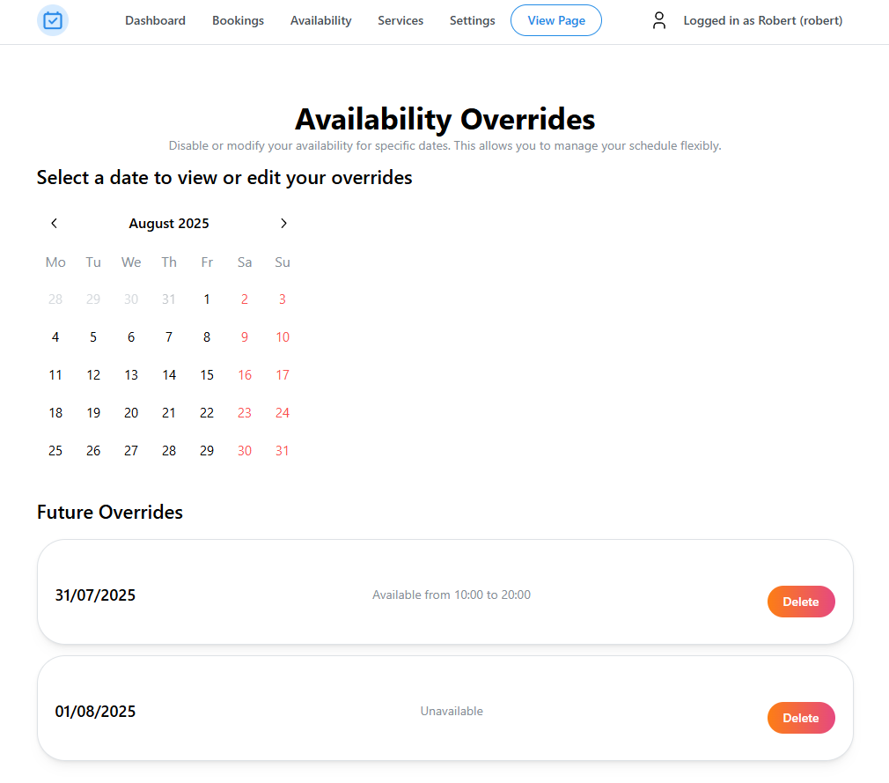

You read that right, Availability Overrides are now working! This was a feature I've been putting off for a while thinking it would take forever, but it wasn't too bad!

Availability overrides are now available in the [Availability section on your Dashboard](https://bookinwith.me/dashboard/availability/overrides).
<!-- truncate -->

You click on any date on the calendar and it will tell you if you have an override on that day, if you don't, you can create one! And if you do, you can delete it! Then at the bottom you can view all of your overrides in the future at a glance and delete them. Have a look at the image below!

If you run into any issues with this, or in general, don't be afraid to shoot me an email at [hello@bookinwith.me](mailto:hello@bookinwith.me)! Suggestions and feedback are also just as welcome!