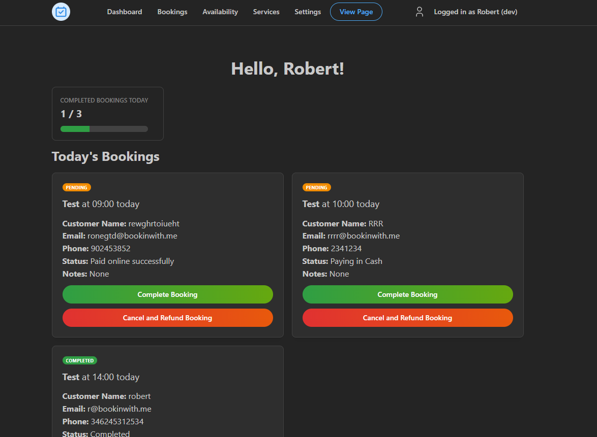

Free tier, pricing, and loads of changes! Let's talk about them, but also a little milestone! We hit 200 commits total on the GitHub repository for Book In With Me!

### Free Tier
You can now use Book In With Me without a subscription, completely free of charge without any card details either. <!-- truncate --> This has been in the plans for a while and now it's here! Now, there is still a paid subscription available which provides way more features, but the free tier gives you a nice start towards your business, or little preview of what we offer!

> You can view all the pricing details and feature separation at the [Pricing section](https://bookinwith.me/pricing).

### Cheaper Subscription
This changelog couldn't get any better, we've decided to knock down the price from 6 euro to a whopping **€4.75 a month**. Our goal with this to make these features more available for people while still being able to maintain this project financially!

### Dashboard Upgrades
We've made the dashboard more sleek, being able to view more bookings at a time, and just overall improvements. Including dark mode all over the site! We've also added these pots at the top with some basic stats of your day, let us know what you'd like to see on those pots, we're looking to add a few more.

>  (I didn't make the test data look nice apologies)

Some other minor changes, we've upgraded some parts of the site, such as the sign in page and more, and hopefully registering process is now fully smooth!

That's all for now, as usual, let us know if you run into any issues! Enjoy!