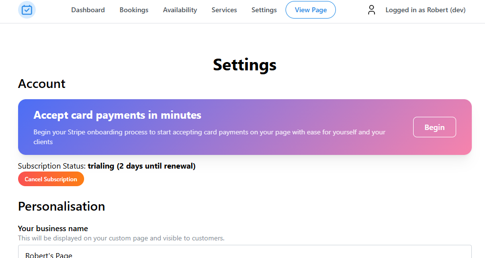
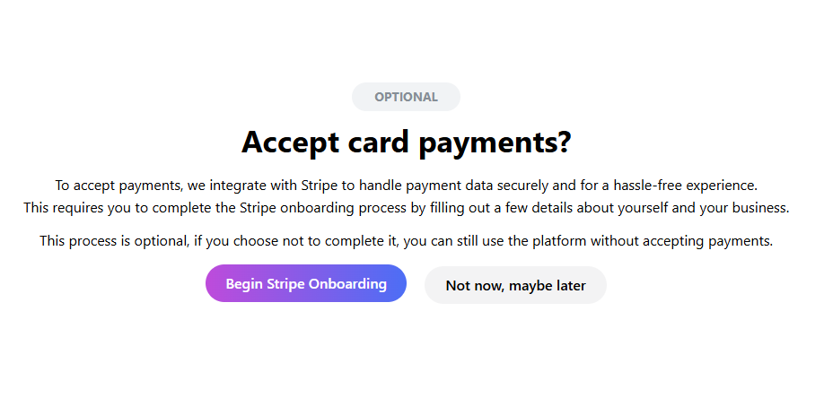

# Stripe Connect

To integrate card payments onto your booking page, you will have to complete the Stripe Connect onboarding! This feature is optional, you can use Book In With Me without having Stripe Connect setup.

[Stripe](https://stripe.com) is a third-party payment processor which we use to streamline taking payments for you and your clients. They require you to fill out a short form to help comply with local laws, this form may include verifying your identity in the future. 

:::tip Note

If you are making your account, you will be prompted to set up Stripe Connect after subscribing.

:::

## How to setup Stripe Connect

- Head over to your [Dashboard Settings](https://bookinwith.me/dashboard/settings), you should see a prompt to accept card payments and begin the Stripe onboarding process! 

:::tip Note
If you do not see this prompt, that means you are already completed the onboarding process and can ignore the next steps!
:::

- Once clicking on **Begin**, you'll be shown the same page when you registered, click on **Begin Stripe Onboarding** and you'll be redirected to Stripe to begin your onboarding

- You'll be asked to fill out a bit of information about yourself, as well as your business. Please fill this out accurately as you may be asked to verify some information by Stripe.

- Once you finished the form, you should be redirected to the dashboard and ready to set up! If you get redirected to a blank page, please refresh the page.